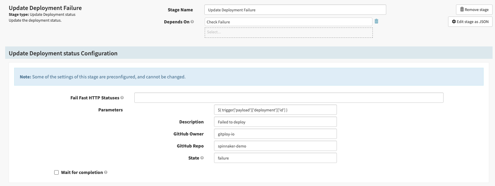
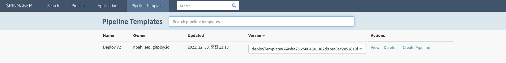
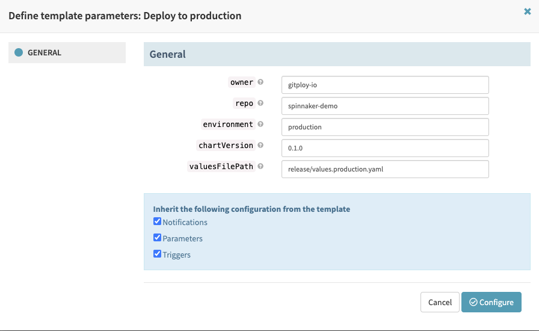

# Spinnaker Demo

This repository shows you a demo of how to integrate with Spinnaker. It demonstrates that Spinnaker is listening for the event and deploys the application to a Kubernetes when Gitploy triggers a new deployment. 


## Step 0: Install Spinnaker

In this demo, we don't explain installing Spinnaker. But Armory provides the command-line tool [Minnaker](https://docs.armory.io/armory-enterprise/installation/minnaker/) to get up and running in a few minutes.

## Step 1: Configure Artifacts

This demo builds an artifact to deploy with Helm chart, one of Kubernetes template engines. And the Helm chart will be overridden for environments, respectively, by values files located under the `release` directory of this repository. To read the Helm chart and values files, we must configure artifacts.

[Configure Helm artifact](https://spinnaker.io/docs/setup/other_config/artifacts/helm/) with the `hal` command:

```shell
# Move into the halyard-0 pod, first.
kubectl exec -it halyard-0 -- sh
```

```shell
hal config artifact helm enable
hal config artifact helm account add \
    --no-validate \
    --repository 'https://gitploy-io.github.io/helm-chart/' \
    helm-demo
```

[Configure Helm artifact](https://spinnaker.io/docs/setup/other_config/artifacts/github/) with the `hal` command:

```shell
hal config artifact github enable
hal config artifact github add \
    --token YOUR_TOKEN \
    github-demo

```

Apply changes:

```shell
hal deploy apply
```

## Step 2: Add custom webhook

As deploying to Kubernetes, Spinnaker has to update the deployment status by the [deployment API call](https://docs.github.com/en/rest/reference/deployments#create-a-deployment-status). Spinnaker provides a simple way to add [a custom stage](https://spinnaker.io/docs/guides/operator/custom-webhook-stages/) instead of extending through codes. Spinnaker can typically make deployment API calls as part of a pipeline by adding a custom stage.

To create a custom webhook, you must add the [configuration](./spinnaker/.hal/default/profiles/orca-local.yml) for the stage in `orca-local.yml` located in `~/.hal/default/profiles`. *Note that you should modify the `GITHUB_TOKEN` string into your token.

After locating the `orca-local.yml`, deploy it in the `halyard-0` pod(i.e. `hal deploy apply`). Then you can find a new stage in your pipeline.



## Step 3: Add a pipeline from the pipeline template

Pipeline template is a amazing feature to share with your teams within a single application, across different applications. In this demo, we'll create a pipeline from the [pipeline template](./spinnaker/pipeline-template/deploy.json). You have to install the [spin](https://spinnaker.io/docs/guides/spin/) CLI, if you haven't already done.

To enable pipeline template:

```shell
hal config features edit --pipeline-templates true
hal deploy apply
```

And save the [pipeline template](./spinnaker/pipeline-template/deploy.json):

```shell
spin pipeline-templates save --file spinnaker/pipeline-template/deploy.json
```

Now you can find the pipeline template in the "Pipeline Template" tab. You just click the "Create pipeline" button and configures variables like below:





## Step 4: Add a GitHub webhook

Now, everything is ready. To trigger the pipeline, you have to [create a organization webhook](https://docs.github.com/en/developers/webhooks-and-events/webhooks/creating-webhooks) and set up the webhook. First of all, we need to expose our local development environment to the internet. [ngrok](https://ngrok.com/download) is a good option for it. You can expose the gate port to listen for events by running `ngrok http 8084`.

```shell
Forwarding    http://7e9ea9dc.ngrok.io -> 127.0.0.1:8084
```

The payload URL should be `http://GATE_HOST/api/v1/webhooks/webhook/app`. Then GitHub will dispatches events to pipelines, and Spinnaker determines to trigger a pipeline by constraints. And you configure the content-type `application/json`, select `deployment` in the events.

Spinnaker trigger the pipeline when you deploy a specific `ref` in Gitploy, and you can follow the deployment status at a glance.