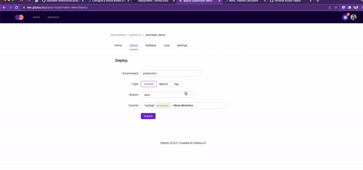
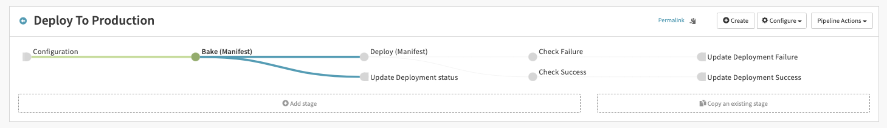

# Spinnaker Demo


## Overview

The demo shows how to integrate with Spinnaker. **The goal is to deploy the commit on GitHub to Kubernetes**.



## Step 0: Install Spinnaker

First, we should install Spinnaker. Armory provides [Minnaker](https://docs.armory.io/armory-enterprise/installation/minnaker/), help to install Spinnaker on Lightweight Kubernetes, so you can install Spinnaker easily. 

## Step 1: Spinnaker Artifacts

Helms provides various [artifacts](https://spinnaker.io/docs/reference/ref-artifacts/). This demo uses the Helm artifact and the GitHub artifact for Kubernetes. Helm artifacts fetch the Helm chart from the official Helm repository, and GitHub artifacts fetch the `values.yaml` file from GitHub.

Move into the halyard-0 pod, first:

```shell
kubectl exec -it halyard-0 -- sh
```

Enable Helm artifact:

```shell
hal config artifact helm enable
hal config artifact helm account add \
    --no-validate \
    --repository 'https://gitploy-io.github.io/helm-chart/' \
    helm-demo
```

Enable GitHub artifact:

```shell
hal config artifact github enable
hal config artifact github add \
    --token YOUR_TOKEN \
    github-demo
```

Apply changes:

```shell
hal deploy apply
```

## Step 2: Spinnaker Custom Webhook Stage

A [deployment status API](https://docs.github.com/en/rest/deployments/statuses#create-a-deployment-status) call is required to update the deployment status in the Spinnaker pipeline. Fortunately, Spinnaker provides a [custom webhook stage](https://spinnaker.io/docs/guides/operator/custom-webhook-stages/) that allows you to call the deployment status API.

To add a custom webhook stage, create a file `~/.hal/default/profiles/orca-local.yml` and add the following content.

<details>

```yaml
webhook:
  preconfigured:
    - label: Update Deployment status
      type: updateDeploymentStatus
      enabled: true
      description: Update the deployment status.
      method: POST
      url: https://api.github.com/repos/${ parameterValues['owner'] }/${ parameterValues['repo'] }/deployments/${ parameterValues['deployment_id'] }/statuses
      customHeaders:
        # GitHub token
        Authorization:
          - token GITHUB_TOKEN
        Content-Type:
          - application/json
      payload: |-
        {
          "description": "${parameterValues['description']}",
          "state": "${parameterValues['state']}",
          "log_url": "http://localhost:9000/#/applications/${execution.application}/executions/details/${execution.id}"
        }
      parameters:
        - label: GitHub Owner
          name: owner
          type: string
        - label: GitHub Repo
          name: repo
          type: string
        - lable: Deployment ID
          name: deployment_id
          type: string
        - label: Description
          name: description
          type: string
        - label: State
          name: state
          type: string
          description: The state can be one of "queued", "in_progress", "success", "failure"
```

</details>

:warning: You should replace `GITHUB_TOKEN` with a Github token with `repo` permission.

Move into the halyard-0 pod, first:

```shell
kubectl exec -it halyard-0 -- sh
```

```shell
hal deploy apply
```

## Step 3: Spinnaker Pipeline

Now, you should create an application in Spinnaker UI. Then add the Spinnaker pipeline and go to *Pipeline Action > Edit as JSON* and save the JSON file below. 

<details>

```json
{
  "appConfig": {},
  "application": "demo",
  "id": "e2e887f0-96cc-485a-9699-4414b96ac1a6",
  "index": 0,
  "keepWaitingPipelines": false,
  "lastModifiedBy": "anonymous",
  "limitConcurrent": true,
  "name": "Deploy to dev",
  "parameterConfig": [],
  "spelEvaluator": "v3",
  "stages": [
   {
    "account": "spinnaker",
    "cloudProvider": "kubernetes",
    "completeOtherBranchesThenFail": false,
    "continuePipeline": true,
    "failPipeline": false,
    "manifestArtifactId": "50d838f7-54b7-4aaf-b922-d0b84e6b43a1",
    "manifests": [],
    "moniker": {
     "app": "demo"
    },
    "name": "Deploy (Manifest)",
    "refId": "2",
    "requisiteStageRefIds": [
     "7"
    ],
    "skipExpressionEvaluation": false,
    "source": "artifact",
    "stageTimeoutMs": 60000,
    "trafficManagement": {
     "enabled": false,
     "options": {
      "enableTraffic": false,
      "services": []
     }
    },
    "type": "deployManifest"
   },
   {
    "completeOtherBranchesThenFail": false,
    "continuePipeline": false,
    "failPipeline": true,
    "name": "Check Success",
    "preconditions": [
     {
      "context": {
       "stageName": "Deploy (Manifest)",
       "stageStatus": "SUCCEEDED"
      },
      "failPipeline": false,
      "type": "stageStatus"
     }
    ],
    "refId": "3",
    "requisiteStageRefIds": [
     "2"
    ],
    "type": "checkPreconditions"
   },
   {
    "name": "Check Failure",
    "preconditions": [
     {
      "context": {
       "stageName": "Deploy (Manifest)",
       "stageStatus": "FAILED_CONTINUE"
      },
      "failPipeline": false,
      "type": "stageStatus"
     }
    ],
    "refId": "4",
    "requisiteStageRefIds": [
     "2"
    ],
    "type": "checkPreconditions"
   },
   {
    "alias": "preconfiguredWebhook",
    "name": "Update Deployment Success",
    "parameterValues": {
     "deployment_id": "${ trigger['payload']['deployment']['id'] }",
     "description": "Finish to deploy successfully",
     "owner": "gitploy-io",
     "repo": "spinnaker-demo",
     "state": "success"
    },
    "refId": "5",
    "requisiteStageRefIds": [
     "3"
    ],
    "statusUrlResolution": "getMethod",
    "type": "updateDeploymentStatus"
   },
   {
    "alias": "preconfiguredWebhook",
    "name": "Update Deployment Failure",
    "parameterValues": {
     "deployment_id": "${ trigger['payload']['deployment']['id'] }",
     "description": "Failed to deploy",
     "owner": "gitploy-io",
     "repo": "spinnaker-demo",
     "state": "failure"
    },
    "refId": "6",
    "requisiteStageRefIds": [
     "4"
    ],
    "statusUrlResolution": "getMethod",
    "type": "updateDeploymentStatus"
   },
   {
    "expectedArtifacts": [
     {
      "defaultArtifact": {
       "customKind": true,
       "id": "dd7f632c-7eb5-4ad9-af54-43e77af986de"
      },
      "displayName": "Artifact",
      "id": "50d838f7-54b7-4aaf-b922-d0b84e6b43a1",
      "matchArtifact": {
       "artifactAccount": "embedded-artifact",
       "customKind": false,
       "id": "852d0c38-abe6-470c-9c1b-b0cdaae1334f",
       "name": "artifact",
       "type": "embedded/base64"
      },
      "useDefaultArtifact": false,
      "usePriorArtifact": false
     }
    ],
    "inputArtifacts": [
     {
      "account": "helm-demo",
      "artifact": {
       "artifactAccount": "helm-demo",
       "id": "b50903e0-a991-4661-b129-4a6f727e3b16",
       "name": "spinnaker-demo",
       "type": "helm/chart",
       "version": "0.1.0"
      }
     },
     {
      "account": "github-demo",
      "artifact": {
       "artifactAccount": "github-demo",
       "id": "2ed72052-54dd-4053-9ac4-ef037d6c5175",
       "name": "release/values.yaml",
       "reference": "https://api.github.com/repos/gitploy-io/spinnaker-demo/contents/release/values.dev.yaml",
       "type": "github/file",
       "version": "${ trigger['payload']['deployment']['sha']  }"
      }
     }
    ],
    "name": "Bake (Manifest)",
    "namespace": "default",
    "outputName": "spinnaker-demo",
    "overrides": {
     "tag": "${ trigger['payload']['deployment']['sha']  }"
    },
    "refId": "7",
    "requisiteStageRefIds": [],
    "templateRenderer": "HELM3",
    "type": "bakeManifest"
   },
   {
    "alias": "preconfiguredWebhook",
    "name": "Update Deployment status",
    "parameterValues": {
     "deployment_id": "${ trigger['payload']['deployment']['id'] }",
     "description": "Spinnaker starts to deploy",
     "owner": "gitploy-io",
     "repo": "spinnaker-demo",
     "state": "in_progress"
    },
    "refId": "8",
    "requisiteStageRefIds": [
     "7"
    ],
    "statusUrlResolution": "getMethod",
    "type": "updateDeploymentStatus"
   }
  ],
  "triggers": [
   {
    "enabled": true,
    "payloadConstraints": {
     "deployment.environment": "dev",
     "repository.full_name": "gitploy-io/spinnaker-demo"
    },
    "source": "app",
    "type": "webhook"
   }
  ],
  "updateTs": "1640829328000"
}
```

</details>



## Step 4: GitHub webhook setting

Now, everything is ready. To trigger the pipeline, you have to [set up an organization webhook](https://docs.github.com/en/developers/webhooks-and-events/webhooks/creating-webhooks). 

:warning: We need to expose our local development environment to the internet. [ngrok](https://ngrok.com/download) is a good option for it. You can expose the gate port to listen for events by running `ngrok http 8084`.

```shell
Forwarding    http://7e9ea9dc.ngrok.io -> 127.0.0.1:8084
```

The payload URL should be `http://GATE_HOST/api/v1/webhooks/webhook/app`. And you have to select `application/json` for the content type and `deployment` for the events.

## Questions
If you have any questions, please leave them in the [community](https://github.com/gitploy-io/gitploy/discussions).
